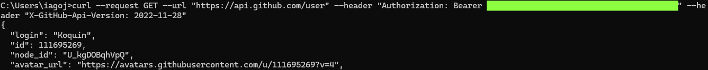

## API PARA VERIFICAR NUMERO DE TELEFONE
#### LINK: https://numverify.com
#### Descrição: Tendo suporte para centenas de locais, requisição para essa API retorna se o numero é válido e outras informações.
Demonstração:

## API PARA VERIFICAR OS DADOS DO USUARIO CUJO TOKEN FOR PASSADO
#### LINK: https://docs.github.com/en/rest?apiVersion=2022-11-28
#### Descrição: API do github para pegar dados do usuario. O usuario é identificado através do token de acesso passado, que no caso, é o meu.
Demonstração:

