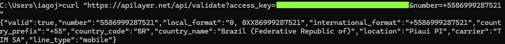

## API PARA VERIFICAR NUMERO DE TELEFONE (IAGO)
#### LINK: https://numverify.com
#### Descrição: Tendo suporte para centenas de locais, requisição para essa API retorna se o numero é válido e outras informações.
Demonstração:


## API PARA VERIFICAR OS DADOS DO USUARIO CUJO TOKEN FOR PASSADO (IAGO)
#### LINK: https://docs.github.com/en/rest?apiVersion=2022-11-28
#### Descrição: API do github para pegar dados do usuario. O usuario é identificado através do token de acesso passado, que no caso, é o meu.
Demonstração:


## API PARA CONTAR PIADAS (PAMELLA)
#### LINK: https://v2.jokeapi.dev/joke/
#### Descrição: API que conta uma piada aleatoria a cada requisição
Demonstração: 


## API DA POKEDEX (SHARA)
Descrição da PokéAPI 
A PokéAPI  é uma API RESTful gratuita que fornece dados detalhados sobre Pokémon, incluindo:  
Informações básicas: Nome, ID, altura, peso.  
Sprites: Imagens oficiais (frente/verso, shiny, etc).  
Tipos, habilidades e estatísticas.  
Evoluções, localizações e itens.  

Ideal para apps de Pokédex, jogos ou projetos de estudo. 
Demonstração via cURL
Para buscar dados do Pikachu diretamente no terminal:  

curl -s https://pokeapi.co/api/v2/pokemon/pikachu | jq '{name: .name, id: .id, types: .types[].type.name, sprite: .sprites.front_default}'

Saída:


Explicação do comando: 
 `curl -s`: Faz a requisição silenciosa.  
`jq`: Filtra apenas os campos relevantes (opcional).  

Outros Exemplos Úteis
1. Listar os primeiros 10 Pokémon:  
   ```bash
   curl -s https://pokeapi.co/api/v2/pokemon?limit=10 | jq '.results[] | .name'
   ```

2. Buscar habilidades do Charizard:  
   ```bash
   curl -s https://pokeapi.co/api/v2/pokemon/charizard | jq '.abilities[].ability.name'
   ```

3. Ver evoluções do Eevee:  
   ```bash
   curl -s https://pokeapi.co/api/v2/evolution-chain/67 | jq '.chain.evolves_to[].species.name'
   ```
